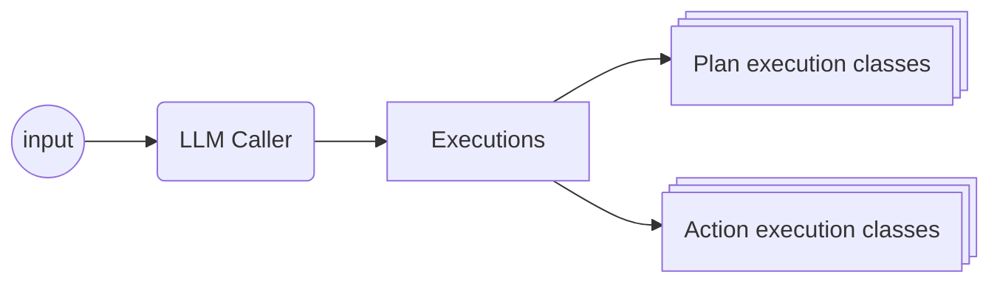

# Simple Cobots Pipeline Framework
This project demonstrates an easy to use hybrid cognitive architecture for "cobotics". 

--- a fancy name for a small project. The ultimate goal is a system that uses an LLM as the driver of natural language understanding, and picks _plans_ or _actions_. Below are examples (there is only one so far). This pipeline is a framework for highly interactive cobots (collaborative robots).



## Examples

### Servo LLM
This directory [servo_llm](servo_llm) is the codebase for a configuration with a Raspberry Pi and a servo motor. This minimal demonstration suggests the extensability of the system. For motoric executions that the LLM caller can access, it only has the base commands of the Servo module.

#### Setup
To set up for this demonstration, connect a servo to the Raspberry Pi.

#### Running
In order to have access to the pins on the RaspberryPi and use the python virtual environment, run
```
sudo path/to/venv/bin/python servo_llm/servo_example.py
```
Then, in the input field, type messages and have the system respond with text and actual motor movements with the servo.
